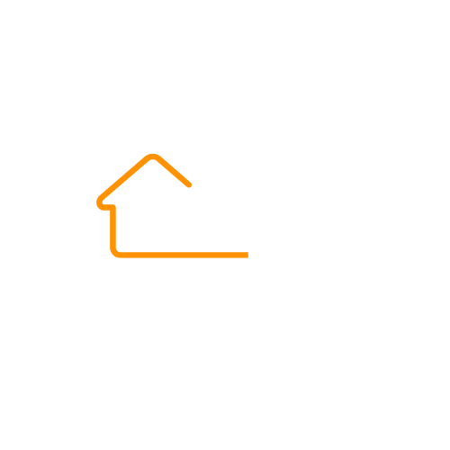

  

  

---
<!-- ===================== SOBRE MIM ===================== -->
<table>
  <tr>
    <td style="vertical-align: top; padding-right: 20px; width: 70%;">
    
  **Me chammo Mateus Dutra, sou natural do Maranhão, e bacharel em ciência e tecnologia pela Universidade Federal do Maranhão, com enfase em TI e Engenharia da computação. Atualmente sou estudante de Engenharia da Computação na UFMA e ando me aperfeiçoando em desenvolvimento web (desde back-end, banco de dados até front-end).**
    

<!-- ===================== O QUE EU SEI FAZER ===================== -->
## 🧩 Minhas Skills & Estudos

<table align="center" width="100%">
  <tr>

  <!-- ===================== CARD 1 ===================== -->
  <td width="50%" valign="top"
    style="
      background-color:#0b1f3a;
      border-radius:16px;
      padding:24px;
      border:1px solid #1f3b5f;
    ">
<h2 align="center">
🛠️ O que eu sei fazer
</h2>

  
  

  
  

  
  

  
  

  </td>

  <!-- ESPAÇO ENTRE OS CARDS -->
  <td width="4%"></td>

  <!-- ===================== CARD 2 ===================== -->
  <td width="50%" valign="top"
    style="
      background-color:#0b1f3a;
      border-radius:16px;
      padding:24px;
      border:1px solid #1f3b5f;
  ">
<h2 align="center">
📚 Atualmente aprendendo
</h2>

  
  

  
  

  

  </td>

  </tr>
</table>

  <!-- CONTATOS -->
---
# Contatos
  
   

  <!-- PROJETOS -->
---
## 🚀 Projetos em Destaque

  <table>
    <tr>
      <td align="center" width="300px">
        <a href="https://github.com/Mateus-dutravale/G2_CONSTRUTORA" target="_blank">
          
            
          <strong>📒 Sistema de Vistoria de Imóveis</strong>
           
          Node.js | REACT | PostgreSQL | HTML | CSS | JavaScript
            
          🔗 Clique aqui para ir pro repositório
        </a>
      </td>

  <td align="center" width="300px">
        <a href="https://github.com/Mateus-dutravale/support-platform-for-the-elderly" target="_blank">
          
            
          <strong>🏥 Plataforma de Apoio à Saúde</strong>
           
          HTML | CSS | JavaScript | MongoDB
            
          🔗 Clique aqui para ir pro repositório
        </a>
      </td>
  </table>

  <!-- ESTATISTICAS -->
---
## 📊 Estatísticas do GitHub

  <table>
    <tr>
      <td>
        
      </td>
      <td>
        
      </td>
    </tr>
  </table>

---
  <!-- FINAL -->

### 🚀 Sempre aberto a aprender, colaborar e encarar novos desafios.

  

  
  

  

